    
    
    
    
     
    
    
    
    
    

    <a href="https://www.erupt.xyz"><code><b>[ WEBSITE ]</b></code></a>&nbsp;&nbsp;
    <a href="https://demo.erupt.xyz"><code><b>[ LIVE DEMO ]</b></code></a>&nbsp;&nbsp;
    <a href="https://docs.erupt.xyz"><code><b>[ DOCS ]</b></code></a>&nbsp;&nbsp;
    <a href="https://start.erupt.xyz"><code><b>[ START ]</b></code></a>

## How I think

- **Less is more** — the best framework is the one you barely notice.
- **Abstraction over accumulation** — complex problems usually hide a simple model; find it, don't pile code on it.
- **Rewrite without regret** — never married to an implementation, always open to a better one.
